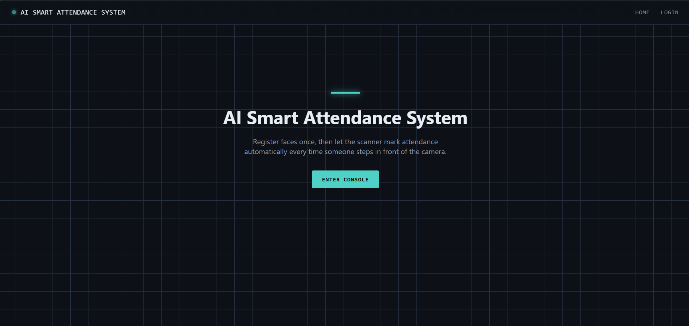
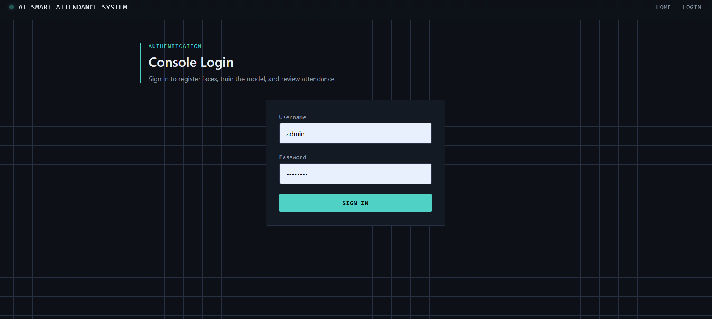
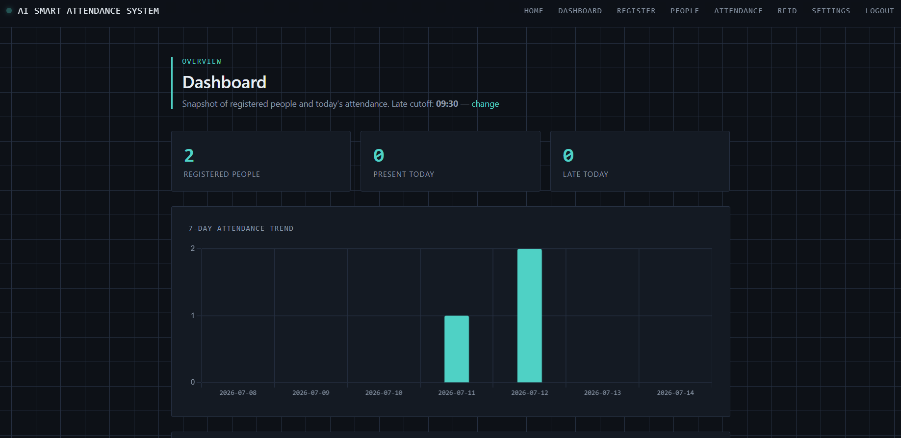
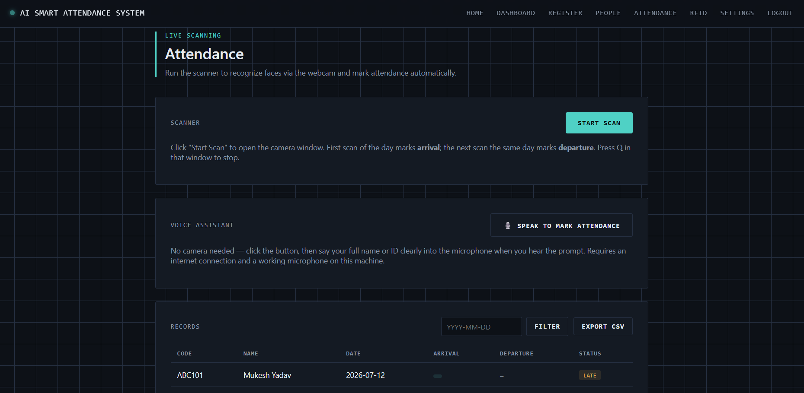
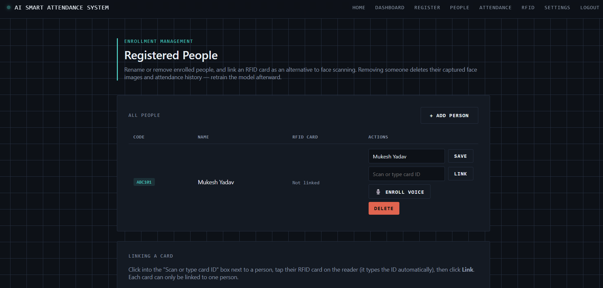
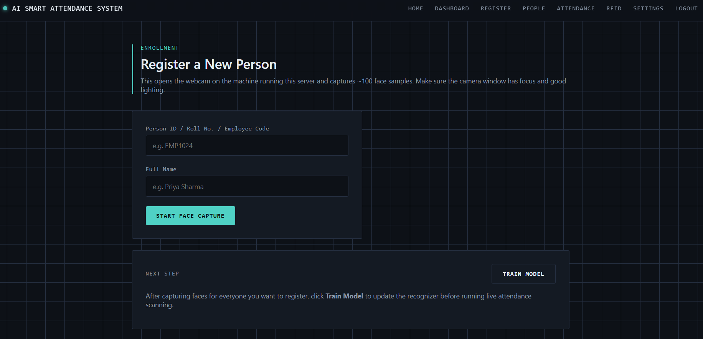
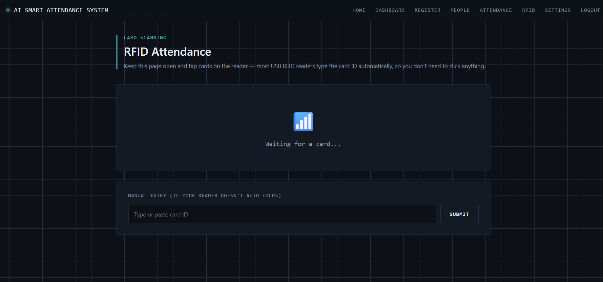
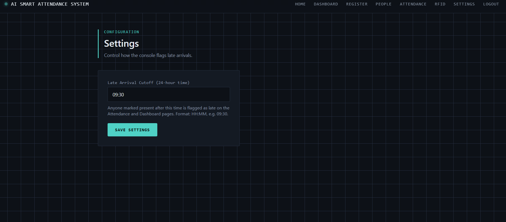

# 🎯 AI Smart Attendance System

An intelligent, multi-modal attendance management system that leverages **Computer Vision, Speech Recognition, and RFID technologies** to automate and secure attendance tracking.

Built with **Flask (Python), OpenCV, and SQLite**, this system provides a flexible and scalable solution for educational institutions and organizations.

---

## 🚀 Key Features

### 👤 Face Recognition Attendance

* Real-time face detection using OpenCV
* LBPH (Local Binary Patterns Histogram) algorithm
* Automatic attendance marking

### 🎤 Voice-Based Attendance

* Speech-to-text conversion
* Name/ID-based attendance marking
* Hands-free interaction

### 🔐 Voice Authentication (Basic)

* Lightweight identity verification using voice input
* Uses MFCC + cosine similarity
* ⚠️ Not production-grade biometric authentication

### 📡 RFID Attendance

* Fast and contactless attendance
* Unique RFID ID mapping

### 📊 Dashboard & Reports

* Attendance tracking and logs
* CSV export support
* Daily attendance insights

### ⏱️ Smart Attendance Logic

* 1st scan → Check-in
* 2nd scan → Check-out
* Duplicate entries prevented

---

## 📸 Screenshots

### 🏠 Home Page


### 🔐 Login Console


### 📊 Dashboard


### 🧠 Attendance System


### 👥 People Management


### 📝 Registration Page


### 📡 RFID Module


### ⚙️ Settings


## 🏗️ Project Architecture

```
AI_SMART_ATTENDANCE_SYSTEM/
│
├── app.py                 # Main Flask application
├── database.py            # Database operations
├── attendance.db          # SQLite database
├── requirements.txt       # Dependencies
├── README.md
│
├── dataset/               # Captured face images
├── trainer/               # Trained ML model
├── voiceprints/           # Saved voiceprints (.npy files)
│
├── static/                # CSS, JS, assets
├── templates/             # HTML templates
│
├── capture_faces.py       # Face data collection
├── train_model.py         # Model training
├── recognize.py           # Face recognition
│
├── voice_assistant.py     # Voice attendance system
├── voice_auth.py          # Voiceprint verification logic
├── enroll.py              # Voice enrollment
│
└── rfid_reader.py         # RFID integration
```

---

## ⚙️ System Workflow

### 1️⃣ Face Recognition Pipeline

* Capture user images → `dataset/`
* Train model → `trainer/`
* Recognize faces via webcam
* Mark attendance automatically

### 2️⃣ Voice Attendance Flow

* User speaks name or ID
* Speech is converted to text
* Matched with database
* If voiceprint exists:

  * Verified using MFCC + cosine similarity
* Attendance marked only if verification passes

### 3️⃣ Voice Enrollment Flow

* Admin clicks **"Enroll Voice"**
* System records 3 voice samples
* Samples averaged into one voiceprint
* Saved as:

  ```
  voiceprints/<person_code>.npy
  ```

### 4️⃣ RFID Workflow

* RFID card scanned
* Unique ID verified
* Attendance logged instantly

---

## 🛠️ Technology Stack

| Layer              | Technology Used            |
| ------------------ | -------------------------- |
| Backend            | Flask (Python)             |
| Computer Vision    | OpenCV                     |
| ML Algorithm       | LBPH Face Recognizer       |
| Speech Recognition | SpeechRecognition (Python) |
| Database           | SQLite                     |
| Frontend           | HTML, CSS, JavaScript      |

---

## 📦 Installation & Setup

### 1️⃣ Clone Repository

```bash
git clone https://github.com/your-username/AI_SMART_ATTENDANCE_SYSTEM.git
cd AI_SMART_ATTENDANCE_SYSTEM
```

### 2️⃣ Install Dependencies

```bash
pip install -r requirements.txt
```

### 3️⃣ Run Application

```bash
python app.py
```

### 4️⃣ Open in Browser

```
http://localhost:5000
```

---

## ⚙️ Configuration

Modify thresholds in code if required:

```python
CONFIDENCE_THRESHOLD = 70
MATCH_CONFIDENCE_CUTOFF = 0.6
```

---

## 📁 Important Notes

* Ensure webcam is properly connected
* Train model before recognition
* Use clear face images for better accuracy

---

## ❗ Limitations

* Voice authentication is **not production-grade**
* Sensitive to:

  * Background noise
  * Microphone quality
  * Voice variations (illness, mood)
* Face recognition depends on lighting conditions
* RFID requires compatible hardware

---

## 🔐 Security Considerations

⚠️ Do NOT upload the following to GitHub:

```
dataset/
trainer/
voiceprints/
attendance.db
.env
```

✔ Add them to `.gitignore` to protect sensitive and biometric data

---

## 🧪 Future Improvements

* Deep Learning-based face recognition (CNN)
* Advanced biometric voice authentication
* Cloud database integration
* Mobile app support
* Admin analytics dashboard

---

## 👨‍💻 Author

**Mukesh Yadav**
MCA Student | AI & Full Stack Developer

---

## 📜 License

This project is developed for **educational purposes only**.

---

## ⭐ Contribution

Contributions, issues, and feature requests are welcome!

Feel free to fork and improve this project 🚀
